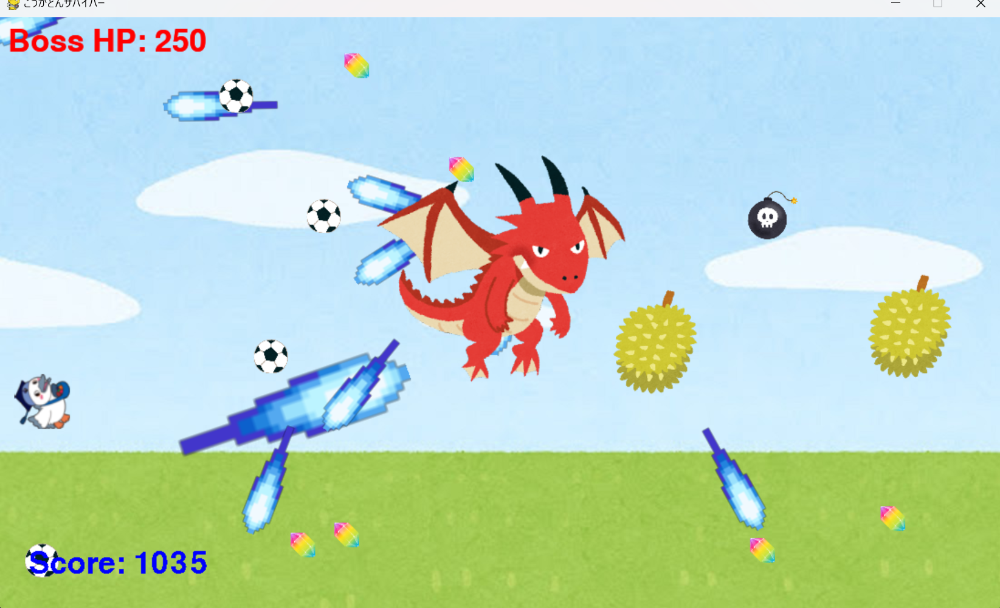

# こうかとんサバイバー

## 実行環境の必要条件
* python >= 3.10
* pygame >= 2.1

## ゲームの概要
* この世界の勇者である「こうかとん」が街を脅かす赫龍「アクノロギア」を討伐するべく冒険に出かけた。道中押し寄せてくる大量の敵や狂人を倒しながら無事赫竜を討伐することができるのか...!!

## ゲームの遊び方
* 方向キーで「こうかとん」を操作し、画面外から出現する敵を自動発射追尾型ビームを駆使して倒す。
* こうかとんが敵にぶつかるとゲームオーバー。
* 時間経過でお助けアイテムがランダムで出現。
* 敵を倒すとスコアが増え、150点ごとにスキル(下記記載)の選択が可能となる。
* スコアが1000に達するとボスが出現する
* ボスを倒せれば、ゲームクリアとなる。
### 入力キー 「選択可能スキル」
1) 「ドリアン」
   * 巨大かつ貫通攻撃で敵をなぎ倒し壁で反射する。スピードが遅い。
2) 「サッカーボール」
   * 素早いスピードで敵や壁にあたると反射する。小さい。
### アイテム詳細
1) 「宝石」
   * こうかとんの移動速度とビームの大きさを拡大し、発射速度を上げる。
2) 「爆弾」
   * 重力場を発動し一定時間敵を一掃する

## ゲームの実装
### 共通基本機能
* 背景画像と主人公キャラクターの描画
* 主人公に追尾してくる敵の出現
* スコアの表示

### 分担追加機能
1. 敵に追尾するビームの発射（担当：小川 輝）
2. スキル機能（担当：神田 哲真）
3. スキル「ドリアン」壁反射で敵貫通（担当：神田 哲真）
4. スキル「サッカーボール」壁反射で敵反射（担当：神田 哲真）
5. 新しい敵を作成（敵ごとに速度を変化）（担当：熊田 大樹）
6. 一定時間経過で強化アイテムをランダム出現（担当：鹿又 大和）
7. 移動速度強化＆ビーム強化アイテムと重力場アイテムの生成（担当：鹿又 大和）
8. ボスの出現と行動（ボス出現中は雑魚敵の出現する）

### ToDo
- [X] 敵に追尾するビームの発射
- [x] レベルアップ機能
- [x] ドリアンの生成
- [x] サッカーボールの生成
- [x] 新しい敵を作成（敵ごとに速度を変える）
- [x] 一定時間たったら強化アイテムをどこかに出現させる
- [x] 何体か倒したらボスを出現（ボスの出現中は雑魚が出ない）
- [x] 重力波を発生
### 実装したかった追加機能
- マルチビームの生成
- こうかとんのダメージをHP制にする
- 回復アイテムを表示する
- 敵の体力増加
- ビームのダメージ増加

### メモ

